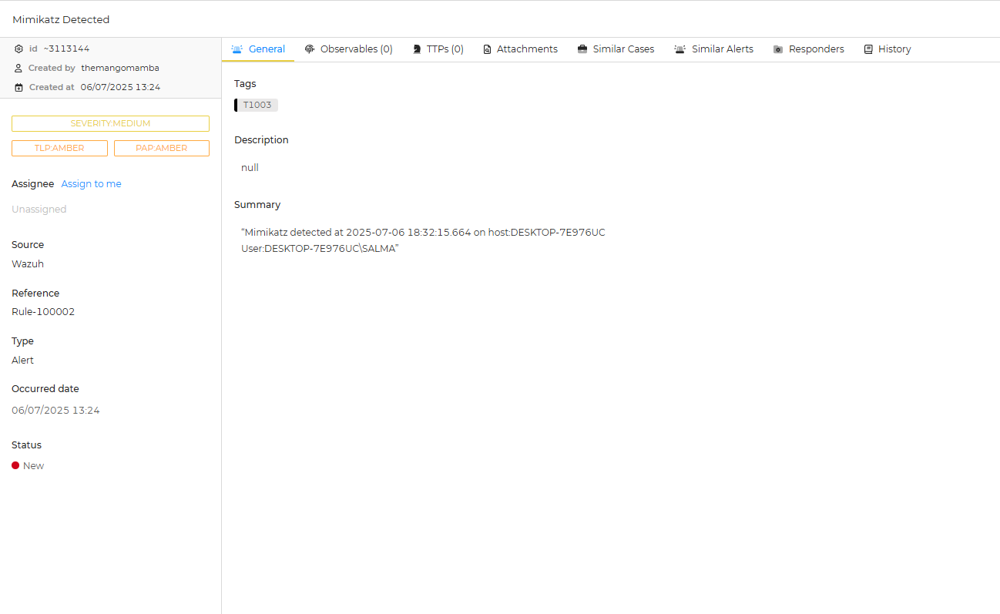

# SOC Automation Project: Automated Threat Detection and Response

## Project Overview

This project demonstrates the implementation of a comprehensive Security Operations Center (SOC) automation pipeline using open-source tools to detect, analyze, and respond to security threats. The system simulates real-world attack scenarios and automates the incident response process from initial detection through alert enrichment and analyst notification.

### Objective
The objective of this project is to build an automated security incident response system that can:
- Detect malicious file execution in real-time
- Enrich alerts with threat intelligence
- Create incident tickets for security analysts
- Notify the appropriate personnel via email

### Tools and Technologies Used
- **Windows 10 VM**: Target system for attack simulation
- **Wazuh**: Open-source SIEM for log collection and alert generation
- **TheHive**: Incident response platform for case management
- **Shuffle**: Security Orchestration, Automation and Response (SOAR) platform
- **VirusTotal**: Threat intelligence platform for IOC enrichment
- **Mimikatz**: Credential dumping tool used for attack simulation

## Architecture Overview

The project utilizes a cloud-based architecture with multiple components working together to create a comprehensive security monitoring and response system. The Windows 10 VM serves as the monitored endpoint, while Wazuh acts as the central SIEM collecting and analyzing logs.

## Implementation Details

### Infrastructure Setup

The project infrastructure was deployed using cloud-based virtual machines configured with appropriate network settings and firewall rules to ensure secure communication between components.

### Wazuh Configuration

A custom Wazuh rule was implemented to detect file execution events, specifically targeting the execution of Mimikatz:

- **Rule ID**: 100002
- **Alert Level**: 15 (High Severity)
- **Detection Logic**: Monitors for file execution events and triggers high-severity alerts

The Wazuh agent was successfully deployed and configured on the Windows 10 VM to forward security events to the central Wazuh manager.

### Backend Services Configuration

Backend services including Elasticsearch and Cassandra were configured to support the SIEM and case management platforms, ensuring TheHive has reliable data storage and retrieval.

### TheHive Integration

TheHive was configured as the incident response platform to receive and manage security alerts generated by the automation workflow.

## Automation Workflow

The automation workflow in Shuffle was designed to handle the complete incident response lifecycle:

1. **Alert Reception**: Receives alerts from Wazuh containing file execution details
2. **Hash Extraction**: Extracts SHA256 file hash from the alert data
3. **Threat Intelligence Enrichment**: Queries VirusTotal API for file reputation analysis
4. **Incident Creation**: Creates structured incident tickets in TheHive
5. **Notification**: Sends email alerts to security analysts

## Testing and Validation

### Attack Simulation

The attack simulation involved executing Mimikatz on the Windows 10 VM to demonstrate credential dumping techniques commonly used by threat actors.

### Detection Results

The Wazuh SIEM successfully detected the Mimikatz execution and generated a high-severity alert (Level 15) with rule ID 100002, demonstrating effective real-time threat detection capabilities.

### Automation Execution

The Shuffle workflow successfully processed the alert, extracted the file hash, and performed threat intelligence enrichment using VirusTotal.

The VirusTotal analysis provided detailed information about the file's reputation and potential threats, enabling informed decision-making for incident response.

### Incident Management

**Note:** This rule already exists from a previous execution.

Incidents were successfully created in TheHive with enriched threat intelligence data, providing security analysts with comprehensive information for investigation and response.

### Notification System

The automated email notification system successfully delivered incident details to security analysts, ensuring timely awareness of security events.

## Challenges and Solutions

### Configuration Complexity
The project encountered several technical challenges during implementation:

- **Wazuh Agent Configuration**: Navigating and correctly configuring the Wazuh agent configuration files required extensive troubleshooting
- **Multi-Agent Setup**: Attempting to configure multiple Wazuh agents revealed additional complexity in agent management
- **Shuffle Workflow Formatting**: Data formatting issues between different platforms required careful attention to JSON structure and API compatibility

### Time Investment
The project required approximately 20 hours over one week to complete, with significant time dedicated to:
- Initial tool installation and configuration
- Troubleshooting integration issues
- Fine-tuning automation workflows
- Testing and validation procedures

## Results and Analysis

### Successful Outcomes
- **Real-time Threat Detection**: Wazuh successfully detected malicious file execution with appropriate severity levels
- **Automated Enrichment**: VirusTotal integration provided valuable threat intelligence for incident analysis
- **Incident Management**: TheHive integration created structured incident tickets for analyst review
- **Notification System**: Email alerts ensured timely notification of security events

### Performance Metrics
- **Detection Time**: Near real-time detection of file execution events
- **Enrichment Speed**: Rapid threat intelligence gathering via VirusTotal API
- **End-to-End Processing**: Complete workflow execution from detection to notification

### Areas for Improvement
- **Configuration Management**: Implement infrastructure as code for easier deployment and management
- **Error Handling**: Enhance workflow error handling and retry mechanisms
- **Scalability**: Optimize for handling higher volumes of security events
- **Custom Rules**: Develop more sophisticated detection rules for various attack patterns

## Conclusion

This SOC automation project successfully demonstrates the implementation of a comprehensive security monitoring and response system using open-source tools. The solution effectively automates the incident response lifecycle from initial threat detection through analyst notification, significantly reducing response times and improving security posture.

The project showcases practical skills in:
- SIEM deployment and configuration
- Security automation and orchestration
- Threat intelligence integration
- Incident response procedures
- Cloud infrastructure management

### Real-World Applications
This automation framework can be adapted for enterprise environments to:
- Reduce manual security operations workload
- Improve incident response times
- Enhance threat detection capabilities
- Standardize security workflows
- Provide comprehensive audit trails

This project demonstrates the practical application of security automation concepts and provides a foundation for building more sophisticated SOC capabilities in enterprise environments.